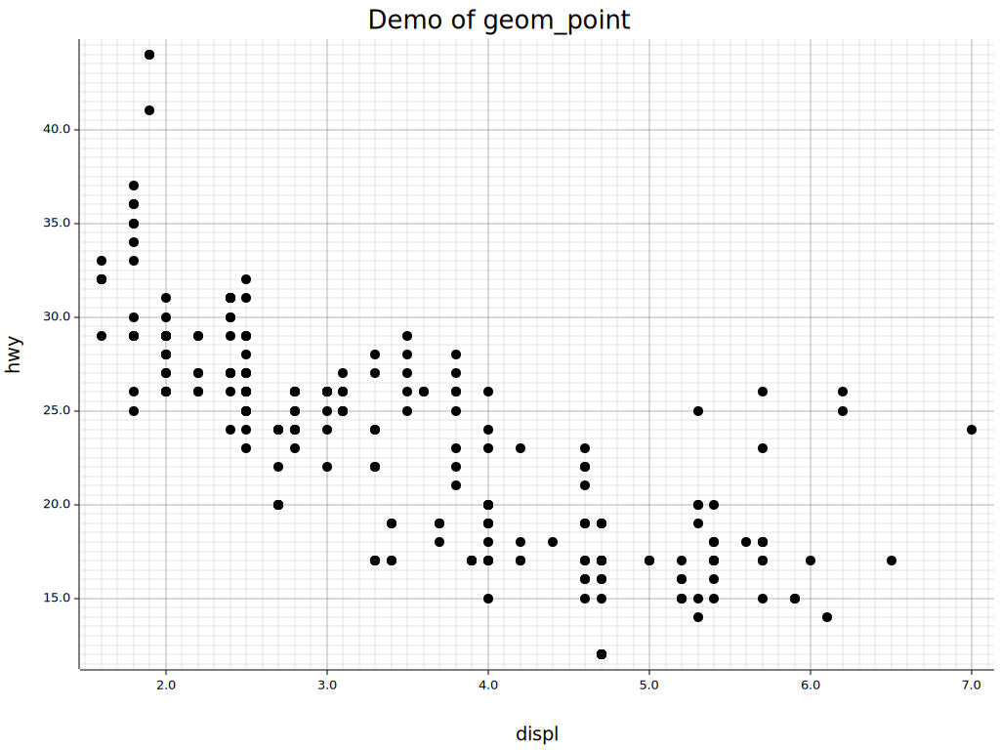

# Gongbi (工笔)

A data visualization crate based on plotters

## Usage

```rust
let mpg = CsvReadOptions::default()
    .with_has_header(true)
    .try_into_reader_with_file_path(Some("examples/mpg.csv".into()))?
    .finish()?;

let plot = plot!(mpg, aes!("displ", "hwy"), save = "gongbi.svg") + geom_point!();

plot.draw()?;
```



## License

Licensed under either of

- Apache License, Version 2.0, ([LICENSE-APACHE](LICENSE-APACHE) or http://www.apache.org/licenses/LICENSE-2.0)
- MIT license ([LICENSE-MIT](LICENSE-MIT) or http://opensource.org/licenses/MIT)

at your option.

### Note

- `mpg.csv` is copied from [ggplot2](https://github.com/tidyverse/ggplot2) package.
